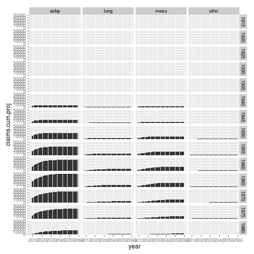

==Process Stallard Data tables


1
in the attached by Stallard Tables 3-6 -- just need the upper block Date of first exposure and Date of claim In data frames


```r
projyears = seq(2009, 2059, 5)
projvec = projyears[1]:projyears[11]
nproj = length(projvec)

rdtbl <- function(infile, inj) {
    cnames <- c("exp.year", projyears, "total", "development.factor")
    tbl = read.delim(infile, header = F, sep = " ")
    colnames(tbl) = cnames
    tbl$injury = inj
    # str(tbl) print(tbl)
    return(tbl)
}
```


```r
table3 = rdtbl("table3.txt", "meso")
table4 = rdtbl("table4.txt", "lung")
table5 = rdtbl("table5.txt", "othc")
table6 = rdtbl("table6.txt", "asbp")
basedf = rbind(table3, table4, table5, table6)
```

2
Build a set of data frames in which the dates of claims are by single year, not 5-year groups
Basically, let y = the cumulative number of claims, going across
Then build a splinefun of the cumulative number of claims
Interpolate the spline fun to individual years
Go from cumulative back to indiv year counts by subtraction
(Standard demographic stuff)


```r
sps = function(sdf) {
    # print(sdf)
    ss = spline(x = sdf$year, y = sdf$claims, method = "hyman", xout = projvec)
    spsdf = data.frame(year = ss$x, claims.cum.proj = ss$y, claims.proj = ss$y)
    ns = nrow(spsdf)
    spsdf$claims.proj[2:ns] = spsdf$claims.proj[2:ns] - spsdf$claims.proj[1:(ns - 
        1)]
    return(spsdf)
}

sdata <- function(df) {
    tbl <- df[, 2:12]
    for (cc in 2:11) {
        tbl[, cc] = tbl[, cc] + tbl[cc - 1]
    }
    
    # print(df) print(tbl)
    tbl$exp.year = as.numeric(substring(df$exp.year, 1, 4))
    tbl$injury = df$injury
    tbl = tbl[order(tbl$injury, tbl$exp.year), ]
    # print(tbl)
    tall = melt(tbl, id = c("injury", "exp.year"), variable.name = "claim.year", 
        value.name = "claims", stringsAsFactors = F)
    tall$year = as.numeric(as.character(tall$claim.year))
    # str(tall)
    tall$exp.to.claim = with(tall, year - exp.year)
    # tall=tall[order(tall$injury,tall$exp.year),]
    # sdf=data.frame(exposure=tall$exp.year,claims=tall$value,year=projyears[as.numeric(tall$variable)])
    # okay so we have 14 exposure periods of 11 obs each
    # xdf=data.frame(data.first.exposure=character(),year=numeric(),cum.proj=numeric(),inc.proj=numeric())
    # for (exp in 1:14) { rn=exp*11 r1=rn-11+1 print(sps) decumulate
    
    # print(sdfx) isps=sps isps[2:nproj]=sps[2:nproj]-sps[1:(nproj-1)]
    # print(isps)
    # tdf=(data.frame(data.first.exposure=rep(df$exp.year[exp],nproj),year=projvec,
    # cum.proj=sps,inc.proj=isps))
    return(tall)
}
projectdf = sdata(basedf)
# print(projectdf)
projectp = ddply(projectdf, c("injury", "exp.year"), "sps")
# print(projectp)
g <- ggplot(projectdf, aes(claim.year, claims)) + geom_bar(stat = "identity") + 
    facet_grid(exp.year ~ injury)
print(g)
```

 

```r
g <- ggplot(projectp, aes(year, claims.cum.proj)) + geom_bar(stat = "identity") + 
    facet_grid(exp.year ~ injury)
print(g)
```

```
## Warning: position_stack requires constant width: output may be incorrect
## Warning: position_stack requires constant width: output may be incorrect
## Warning: position_stack requires constant width: output may be incorrect
## Warning: position_stack requires constant width: output may be incorrect
## Warning: position_stack requires constant width: output may be incorrect
## Warning: position_stack requires constant width: output may be incorrect
## Warning: position_stack requires constant width: output may be incorrect
## Warning: position_stack requires constant width: output may be incorrect
## Warning: position_stack requires constant width: output may be incorrect
## Warning: position_stack requires constant width: output may be incorrect
## Warning: position_stack requires constant width: output may be incorrect
## Warning: position_stack requires constant width: output may be incorrect
## Warning: position_stack requires constant width: output may be incorrect
## Warning: position_stack requires constant width: output may be incorrect
## Warning: position_stack requires constant width: output may be incorrect
## Warning: position_stack requires constant width: output may be incorrect
## Warning: position_stack requires constant width: output may be incorrect
## Warning: position_stack requires constant width: output may be incorrect
## Warning: position_stack requires constant width: output may be incorrect
## Warning: position_stack requires constant width: output may be incorrect
## Warning: position_stack requires constant width: output may be incorrect
## Warning: position_stack requires constant width: output may be incorrect
## Warning: position_stack requires constant width: output may be incorrect
## Warning: position_stack requires constant width: output may be incorrect
## Warning: position_stack requires constant width: output may be incorrect
## Warning: position_stack requires constant width: output may be incorrect
## Warning: position_stack requires constant width: output may be incorrect
## Warning: position_stack requires constant width: output may be incorrect
## Warning: position_stack requires constant width: output may be incorrect
## Warning: position_stack requires constant width: output may be incorrect
## Warning: position_stack requires constant width: output may be incorrect
## Warning: position_stack requires constant width: output may be incorrect
## Warning: position_stack requires constant width: output may be incorrect
## Warning: position_stack requires constant width: output may be incorrect
## Warning: position_stack requires constant width: output may be incorrect
## Warning: position_stack requires constant width: output may be incorrect
## Warning: position_stack requires constant width: output may be incorrect
## Warning: position_stack requires constant width: output may be incorrect
## Warning: position_stack requires constant width: output may be incorrect
## Warning: position_stack requires constant width: output may be incorrect
## Warning: position_stack requires constant width: output may be incorrect
## Warning: position_stack requires constant width: output may be incorrect
## Warning: position_stack requires constant width: output may be incorrect
## Warning: position_stack requires constant width: output may be incorrect
## Warning: position_stack requires constant width: output may be incorrect
## Warning: position_stack requires constant width: output may be incorrect
## Warning: position_stack requires constant width: output may be incorrect
## Warning: position_stack requires constant width: output may be incorrect
## Warning: position_stack requires constant width: output may be incorrect
## Warning: position_stack requires constant width: output may be incorrect
## Warning: position_stack requires constant width: output may be incorrect
## Warning: position_stack requires constant width: output may be incorrect
## Warning: position_stack requires constant width: output may be incorrect
## Warning: position_stack requires constant width: output may be incorrect
## Warning: position_stack requires constant width: output may be incorrect
## Warning: position_stack requires constant width: output may be incorrect
```

 

```r
# print(g) xdf=rbind(xdf,tdf) }
```


3
Then build a function
Given a vector of years of first exposure, injury (4-level injuries here), and current date
Return a data frame
     Variables year of future claim
     Expected number of claims (NOT rounded at this point)
Processing
   Each incoming vector element produces a set of probabilities, going across, based on single year of claim counts from 2 above
   Then add these probabilities across all vector elements
SInce the starting date will be in the middle of a year, you will have to prorate the first year of expected counts accordingly
You might allow for an additional weight vector on input

4
Build an inverter function
Suppose we have a matrix of counts from a trust that is in the same form as the Stallard matrix, but by year of claim
We also have a "from date" and a "to date" for dates of claims
We want to estimate how our trust's mix of claims by "Date of first exposure" compares with the Stallard mix
Simple inverter -- between "from date" and "to date" in each first exposure group, calculate the ratio of our total number of claims divided by the stallard number
Return a frame
        date of first exposure (grouped)
        ratio of us to stallard

5
You can feed these ratios into function 3 as "pseudo counts" to get the runoff curves for out trust's particular mix of first exposures
